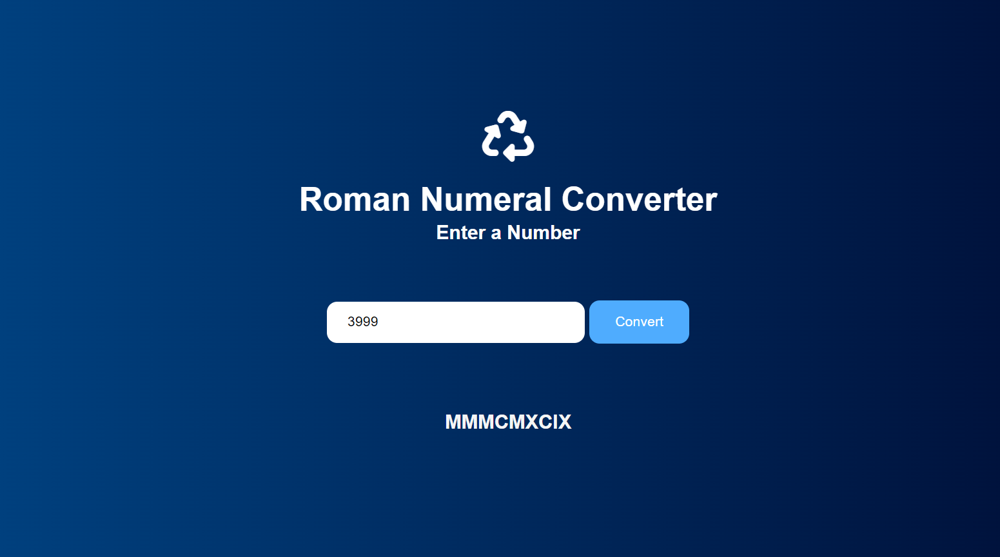

# Roman-Numerals-Converter 🚀

## Project Description 📝

>
 This is an application that convert any number in to roman number . it has all the requirement of freecodecamp project . and consist of below elements:

 Input Element:an input element with an id of "number".
 Button Element:button element with an id of "convert-btn".
 Result Element:have a div element with an id of "output".
 Alert for Empty Input: When you click on the #convert-btn element without entering a value into the #number element, the #output element should contain the text "Please enter a valid number".
 Validation for Negative Number: When the #number element contains the number -1 and the #convert-btn element is clicked, the #output element should contain the text "Please enter a number greater than or equal to 1".
 Validation for Large Number: When the #number element contains the number 4000 or greater and the #convert-btn element is clicked, the #output element should contain the text "Please enter a number less than or equal to 3999".

>


```java script
 convert.addEventListener('click', () => { 
    let value = input.value;
    if (!value){
      output.innerText = 'Please enter a valid number';
    } else if (value < 0) {
        output.innerText = 'Please enter a number greater than or equal to 1';
      } else if (value > 3999) {
        output.innerText = 'Please enter a number less than or equal to 3999';
      } else {
        let result = '';
        for (const[roman, number] of numerals) {
          while(value >= number) {
          result += roman;
          value -= number;
        }
        }
        output.innerText = result; 
      }
      });
    


```


## Demo 📸

life demo link [()]
here is a .




## Technologies Used 🛠️

List the technologies or tools that i used to develop this project. 
- HTML
- CSS
- java script


## Installation 💻

for using this project you neet to install 3 things:

- chrombrowser
- an IDE like vscode
- git
- node JS


## Usage 🎯

for using this project you need to know a few commond first clone the repositry in yor local machine then go to the github directory . open the project on your IDE like vscode and start working on it .


go to the cmd and clone the Technical Documentation Page 
using this commond:
```bash

git clone https://github.com/FarwaMuhibZada/Roman-Numerals-Converter.git 
```
go to the githu directory:
```bash

cd>Roman-Numerals-Converter

```
open the project on your IDE like vscode :

```bash

cd>Roman-Numerals-Converter .

```


## Features ⭐
- take an inpute from user
- check the entered number
- has multipal conditions
- convert any number into Roman number
- give an output as result 
- return a alert box if there is an empty value 


## FarwaMuhibzada 👩‍💻


- LinkedIn: [(https://www.linkedin.com/in/farwa-muhibzada/)]
- Email: [(farwafarid2017@gmail.com)]

## Contributing 🤝
For contribution you can create a pull request and mention me there.Thank you.